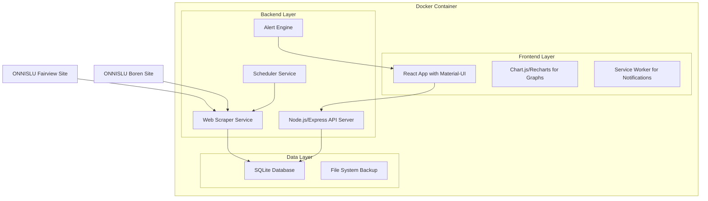

# Design Document

## Overview

The ONNISLU Price Tracker is a React-based web application that monitors apartment pricing and availability across two buildings (Fairview and Boren). The system uses automated web scraping to collect data twice daily, stores historical pricing information, and provides interactive visualizations with Material Design UI components. The entire application runs in a Docker container for easy deployment and maintenance.

## Architecture

### High-Level Architecture



### Technology Stack

**Frontend:**
- React 18 with TypeScript
- Material-UI (MUI) v5 for design system
- Recharts for data visualization
- React Router for navigation
- Axios for API communication

**Backend:**
- Node.js with Express.js
- TypeScript for type safety
- Puppeteer for web scraping
- node-cron for scheduling
- SQLite3 for database
- Winston for logging

**Infrastructure:**
- Docker with multi-stage build
- Docker Compose for development
- Volume mounts for data persistence

## Components and Interfaces

### Frontend Components

#### Core Components
1. **App Component**: Main application shell with routing
2. **Dashboard**: Overview of all floor plans with key metrics
3. **FloorPlanCard**: Individual floor plan display with pricing info
4. **PriceChart**: Interactive price history visualization
5. **AlertPanel**: Display price alerts and notifications
6. **FilterPanel**: Search and filter controls
7. **ExportDialog**: CSV export functionality
8. **SettingsPanel**: Alert threshold configuration

#### Component Hierarchy
```
App
├── Header (with navigation)
├── AlertPanel
├── Dashboard
│   ├── FilterPanel
│   ├── FloorPlanGrid
│   │   └── FloorPlanCard[]
│   └── PriceChart
├── SettingsPanel
└── ExportDialog
```

### Backend Services

#### API Endpoints
```typescript
// Floor Plans
GET /api/floorplans - Get all floor plans with latest data
GET /api/floorplans/:id - Get specific floor plan details
GET /api/floorplans/:id/history - Get price history for floor plan

// Pricing Data
GET /api/prices/latest - Get latest prices for all floor plans
GET /api/prices/history?start=date&end=date - Get price history range

// Alerts
GET /api/alerts - Get active alerts
POST /api/alerts/settings - Update alert thresholds
DELETE /api/alerts/:id - Dismiss alert

// Data Export
GET /api/export/csv - Export data as CSV

// System Status
GET /api/status - Get system status and next collection time
```

#### Service Classes
1. **ScraperService**: Handles web scraping logic
2. **DataService**: Database operations and data management
3. **AlertService**: Price change detection and alert generation
4. **SchedulerService**: Manages data collection timing
5. **ExportService**: Handles data export functionality

## Data Models

### Database Schema

```sql
-- Buildings table
CREATE TABLE buildings (
    id INTEGER PRIMARY KEY,
    name TEXT NOT NULL,
    url TEXT NOT NULL,
    created_at DATETIME DEFAULT CURRENT_TIMESTAMP
);

-- Floor plans table
CREATE TABLE floor_plans (
    id INTEGER PRIMARY KEY,
    building_id INTEGER,
    name TEXT NOT NULL,
    bedrooms INTEGER,
    bathrooms REAL,
    has_den BOOLEAN,
    square_footage INTEGER,
    building_position TEXT, -- e.g., "North-facing", "Corner unit"
    image_url TEXT,
    created_at DATETIME DEFAULT CURRENT_TIMESTAMP,
    FOREIGN KEY (building_id) REFERENCES buildings(id)
);

-- Price history table
CREATE TABLE price_history (
    id INTEGER PRIMARY KEY,
    floor_plan_id INTEGER,
    price DECIMAL(10,2),
    is_available BOOLEAN,
    collection_date DATE,
    created_at DATETIME DEFAULT CURRENT_TIMESTAMP,
    FOREIGN KEY (floor_plan_id) REFERENCES floor_plans(id)
);

-- Alerts table
CREATE TABLE alerts (
    id INTEGER PRIMARY KEY,
    floor_plan_id INTEGER,
    alert_type TEXT, -- 'price_drop', 'lowest_price'
    old_price DECIMAL(10,2),
    new_price DECIMAL(10,2),
    percentage_change REAL,
    is_dismissed BOOLEAN DEFAULT FALSE,
    created_at DATETIME DEFAULT CURRENT_TIMESTAMP,
    FOREIGN KEY (floor_plan_id) REFERENCES floor_plans(id)
);

-- Settings table
CREATE TABLE settings (
    id INTEGER PRIMARY KEY,
    key TEXT UNIQUE,
    value TEXT,
    updated_at DATETIME DEFAULT CURRENT_TIMESTAMP
);
```

### TypeScript Interfaces

```typescript
interface Building {
    id: number;
    name: string;
    url: string;
}

interface FloorPlan {
    id: number;
    buildingId: number;
    buildingName: string;
    name: string;
    bedrooms: number;
    bathrooms: number;
    hasDen: boolean;
    squareFootage: number;
    buildingPosition: string;
    imageUrl?: string;
    currentPrice?: number;
    isAvailable: boolean;
    lowestPrice?: number;
    lowestPriceDate?: string;
}

interface PriceHistory {
    id: number;
    floorPlanId: number;
    price: number;
    isAvailable: boolean;
    collectionDate: string;
}

interface Alert {
    id: number;
    floorPlanId: number;
    floorPlanName: string;
    buildingName: string;
    alertType: 'price_drop' | 'lowest_price';
    oldPrice: number;
    newPrice: number;
    percentageChange: number;
    isDismissed: boolean;
    createdAt: string;
}

interface AlertSettings {
    thresholdType: 'dollar' | 'percentage';
    thresholdValue: number;
}
```

## Error Handling

### Frontend Error Handling
- Global error boundary for React component errors
- API error interceptors with user-friendly messages
- Retry mechanisms for failed requests
- Loading states and error states for all components
- Offline detection and graceful degradation

### Backend Error Handling
- Structured error responses with consistent format
- Request validation middleware
- Database transaction rollbacks on errors
- Scraping failure recovery with exponential backoff
- Comprehensive logging with Winston

### Scraping Error Handling
- Website structure change detection
- Timeout handling for slow responses
- Rate limiting to avoid being blocked
- Fallback strategies for partial data collection
- Alert system for scraping failures

## Testing Strategy

### Frontend Testing
- **Unit Tests**: Jest + React Testing Library for components
- **Integration Tests**: API integration testing
- **E2E Tests**: Cypress for critical user flows
- **Visual Tests**: Storybook for component documentation

### Backend Testing
- **Unit Tests**: Jest for service classes and utilities
- **Integration Tests**: Supertest for API endpoints
- **Database Tests**: In-memory SQLite for fast testing
- **Scraping Tests**: Mock websites for scraper validation

### Test Coverage Goals
- Minimum 80% code coverage
- 100% coverage for critical paths (data collection, alerts)
- Performance testing for large datasets
- Load testing for concurrent users

## Deployment and Operations

### Docker Configuration
```dockerfile
# Multi-stage build
FROM node:18-alpine AS builder
# Build frontend and backend

FROM node:18-alpine AS runtime
# Production runtime with minimal dependencies
```

### Data Persistence
- SQLite database stored in Docker volume
- Automated daily backups to mounted volume
- Database migration system for schema updates
- Data integrity checks on startup

### Monitoring and Logging
- Structured JSON logging
- Application health checks
- Scraping success/failure metrics
- Performance monitoring for database queries
- Alert system for application errors

### Configuration Management
- Environment variables for sensitive data
- Configuration files for application settings
- Runtime configuration updates without restart
- Default configurations for easy setup

## Security Considerations

### Web Scraping Ethics
- Respectful scraping with appropriate delays
- User-Agent identification
- Compliance with robots.txt
- Rate limiting to avoid server overload

### Data Security
- No sensitive user data collection
- Secure API endpoints
- Input validation and sanitization
- SQL injection prevention with parameterized queries

### Container Security
- Non-root user in container
- Minimal base image
- Regular security updates
- Network isolation where possible